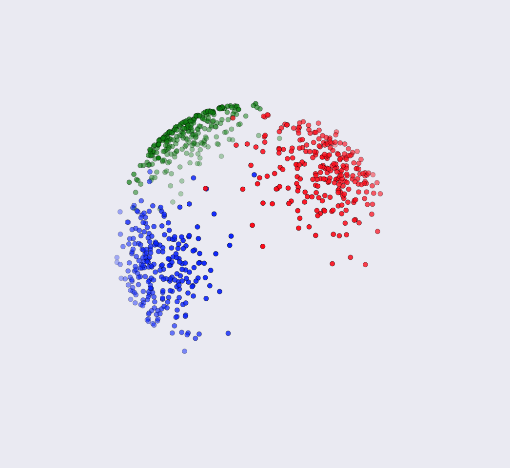
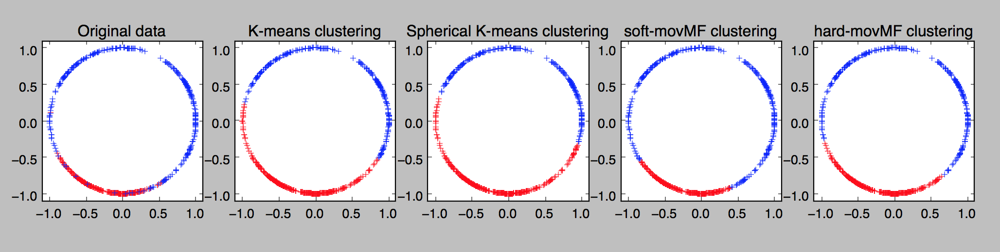
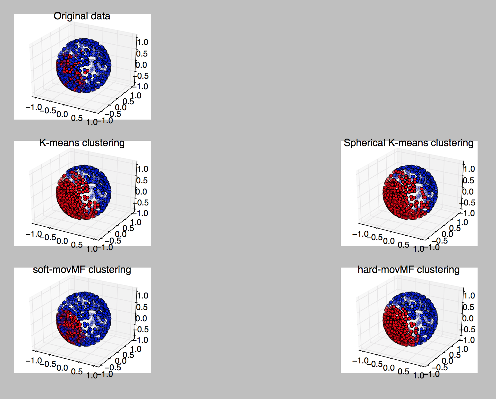
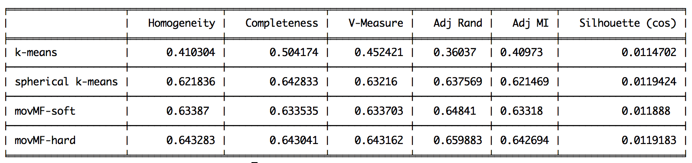

# Clustering on the unit hypersphere in scikit-learn

## Algorithms
This package implements the three algorithms outlined in ["Clustering on the Unit Hypersphere using von Mises-Fisher Distributions"](http://www.jmlr.org/papers/volume6/banerjee05a/banerjee05a.pdf), Banerjee et al., JMLR 2005, for scikit-learn.

1. Spherical K-means (spkmeans)

    Spherical K-means differs from conventional K-means in that it projects the estimated cluster centroids onto the the unit sphere at the end of each maximization step (i.e., normalizes the centroids).

2. Mixture of von Mises Fisher distributions (movMF)

    Much like the Gaussian distribution is parameterized by mean and variance, the [von Mises Fisher distribution](https://en.wikipedia.org/wiki/Von_Mises%E2%80%93Fisher_distribution) has a _mean direction_ `$\mu$` and a _concentration parameter_ `$\kappa$`. Each point `$x_i$` drawn from the vMF distribution lives on the surface of the unit hypersphere `$\S^{N-1}$` (i.e., `$\|x_i\|_2 = 1$`) as does the mean direction `$\|\mu\|_2 = 1$`.  Larger `$\kappa$` leads to a more concentrated cluster of points.

    If we model our data as a [mixture](https://en.wikipedia.org/wiki/Mixture_model) of von Mises Fisher distributions, we have an additional _weight_ parameter `$\alpha$` for each distribution in the mixture. The movMF algorithms estimate the mixture parameters via expectation-maximization (EM) enabling us to cluster data accordingly.

    - soft-movMF

        Estimates the real-valued posterior on each example for each class.  This enables a _soft clustering_ in the sense that we have a probability of cluster membership for each data point.

    - hard-movMF

        Sets the posterior on each example to be 1 for a single class and 0 for all others by selecting the location of the max value in the estimator soft posterior.

    Beyond estimating cluster centroids, these algorithms also jointly estimate the weights of each cluster and the concentration parameters.  We provide an option to pass in (and override) weight estimates if they are known in advance.

    Label assigment is achieved by computing the argmax of the posterior for each example.

## Relationship between spkmeans and movMF

Spherical k-means is a special case of both movMF algorithms.

- If for each cluster we enforce all of the weights to be equal `$\alpha_i = 1/n_clusters$` and all concentrations to be equal and infinite `$\kappa_i \rightarrow \infty$`, then soft-movMF behaves as spkmeans.

- Similarly, if for each cluster we enforce all of the weights to be equal and all concentrations to be equal (with any value), then hard-movMF behaves as spkmeans.

## Other goodies

- A utility for sampling from a multivariate von Mises Fisher distribution in `spherecluster/util.py`.

## Installation
Clone this repo and run

    python setup.py install

or via PyPI

    pip install spherecluster

The package requires that `numpy` and `scipy` are installed independently first.

## Usage
Both `SphericalKMeans` and `VonMisesFisherMixture` are standard sklearn estimators and mirror the parameter names for `sklearn.cluster.kmeans`.

    # Find K clusters from data matrix X (n_examples x n_features)

    # spherical k-means
    from spherecluster import SphericalKMeans
    skm = SphericalKMeans(n_clusters=K)
    skm.fit(X)

    # skm.cluster_centers_
    # skm.labels_
    # skm.intertia_

    # movMF-soft
    from spherecluster import VonMisesFisherMixture
    vmf_soft = VonMisesFisherMixture(n_clusters=K, posterior_type='soft')
    vmf_soft.fit(X)

    # vmf_soft.cluster_centers_
    # vmf_soft.labels_
    # vmf_soft.weights_
    # vmf_soft.concentrations_
    # vmf_soft.intertia_

    # movMF-hard
    from spherecluster import VonMisesFisherMixture
    vmf_hard = VonMisesFisherMixture(n_clusters=K, posterior_type='hard')
    vmf_hard.fit(X)

    # vmf_hard.cluster_centers_
    # vmf_hard.labels_
    # vmf_hard.weights_
    # vmf_hard.concentrations_
    # vmf_hard.intertia_

The full set of parameters for the `VonMisesFisherMixture` class can be found here in the doc string for the class; see `help(VonMisesFisherMixture)`.

**Notes:**

- X can be a dense `numpy.array` or a sparse `scipy.sparse.csr_matrix`

- `VonMisesFisherMixture` has been tested successfully with sparse documents of dimension `n_features = 43256`. When `n_features` is very large the algorithm may encounter numerical instability.  This will likely be due to the scaling factor of the log-vMF distribution.

- `cluster_centers_` in `VonMisesFisherMixture` are dense vectors in current implementation

- Mixture weights can be manually controlled (overriden) instead of learned.

## Testing
From the base directory, run:

    python -m pytest spherecluster/tests/

# Examples

## Small mix
We reproduce the "small mix" example from [Section 6.3](http://www.jmlr.org/papers/volume6/banerjee05a/banerjee05a.pdf) in `examples/small_mix.py`.  We've adjusted the parameters such that one distribution in the mixture has much lower concentration than the other to distinguish between movMF performance and (spherical) k-means which do not estimate weight or concentration parameters.  We also provide a 3D version of this example in `examples/small_mix_3d.py` for fun.

Running these scripts will spit out some additional performance metrics for each algorithm.

It is clear from the figures that the movMF algorithms do a better job by taking advantage of the concentration estimate.

## Document clustering
We also reproduce [this scikit-learn tfidf (w optional lsa) + k-means demo](http://scikit-learn.org/stable/auto_examples/text/document_clustering.html) in `examples/document_clustering.py`.  The results are different on each run, here's a chart comparing the algorithms' performances for a sample run:

Spherical k-means, which is a simple low-cost modification to the standard k-means algorithm performs quite well on this example.

# References

- Primary reference on algorithms: ["Clustering on the Unit Hypersphere using von Mises-Fisher Distributions"](http://www.jmlr.org/papers/volume6/banerjee05a/banerjee05a.pdf).

- Related references:

    - ["movMF: An R Package for Fitting Mixtures of von Mises-Fisher Distributions"](https://cran.r-project.org/web/packages/movMF/vignettes/movMF.pdf), K. Hornik and B.  Grün, Journal of Statistical Software, 2014.

    - ["Directional statistics in machine learning: a brief review"](https://arxiv.org/pdf/1605.00316.pdf), S. Sra, Arxiv, May 2016.

    - ["A short note on parameter approximation for von Mises-Fisher distributions"](http://www.kyb.mpg.de/fileadmin/user_upload/files/publications/attachments/vmfnote_7045%5b0%5d.pdf), S. Sra.

## Attribution

- For large values of `$\eta$` and `$\kappa$` we compute the log-vMF density via approximations found in:

    - ["movMF: An R Package for Fitting Mixtures of von Mises-Fisher Distributions"](https://cran.r-project.org/web/packages/movMF/vignettes/movMF.pdf), K. Hornik and B.  Grün, Journal of Statistical Software, 2014.

        Find more at:

        [https://cran.r-project.org/web/packages/movMF/index.html](https://cran.r-project.org/web/packages/movMF/index.html)

        [Additional references on approximations](https://cran.r-project.org/web/packages/movMF/movMF.pdf)

- Spherical K-Means is a trivial modification to scikit-learn's [sklearn.cluster.KMeans](http://scikit-learn.org/stable/modules/generated/sklearn.cluster.KMeans.html) and borrows heavily from that package.

## See also
- [movMF in R](https://cran.r-project.org/web/packages/movMF/index.html)

- [movMF in python for 3 dimensions (via NIPY)](http://nipy.sourceforge.net/nipy/devel/api/generated/nipy.algorithms.clustering.von_mises_fisher_mixture.html)

- [movMF in C](https://github.com/mrouvier/movMF)

- [sklearn GMM](http://scikit-learn.org/stable/modules/mixture.html)

